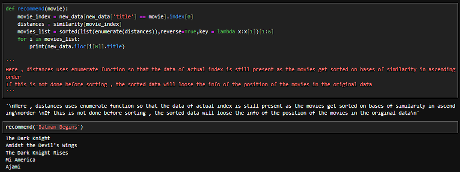
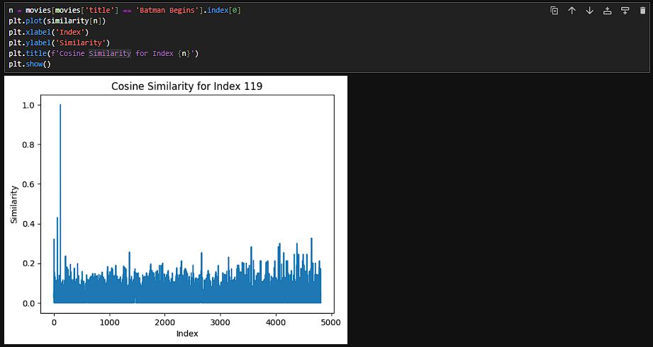

# Movie Recommendataion System

In this project , i have made a movie recommendation system using Numpy , Pandas and Scikit-learn to recommend movies by the type od content.

In this , the cosine similarity method is used to spread out the data points and the closest 5 by ascending order are selected and displayed 

Heres an example :

Cosine similarity Plots :

